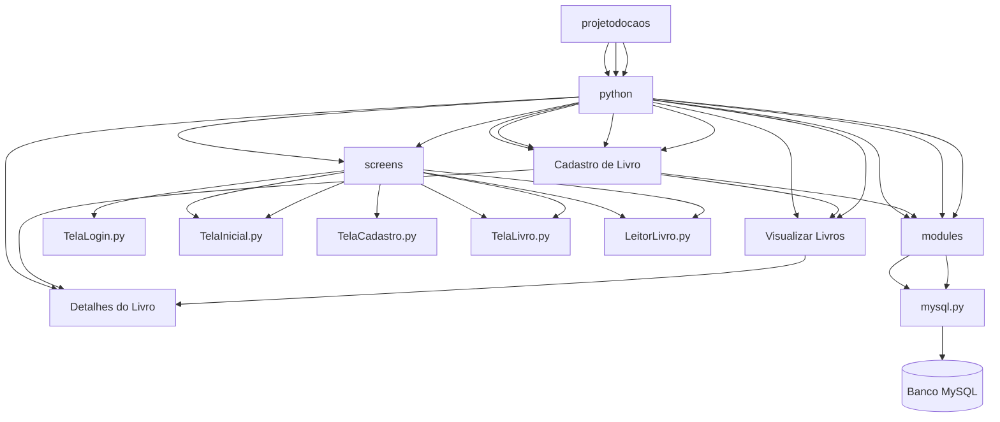
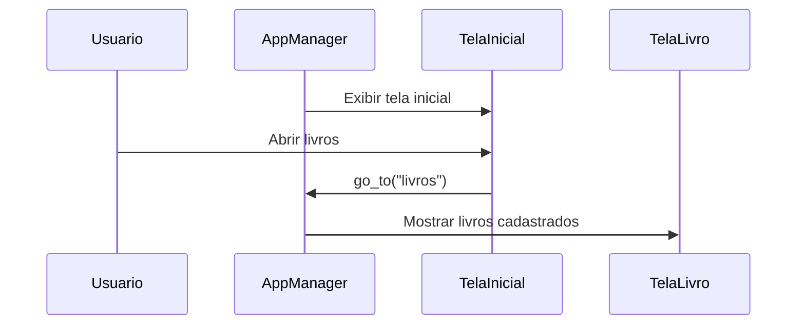
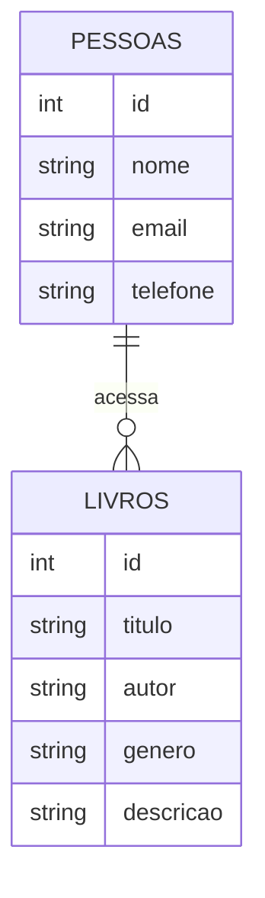

# 📚 Projeto do Caos — Sistema de Gerenciamento de Biblioteca

Sistema desktop desenvolvido em **Python** utilizando **PySide6** para construção da interface gráfica e **MySQL** para persistência de dados.

O objetivo do sistema é permitir o **gerenciamento de livros e leitores**, oferecendo uma interface intuitiva para cadastro, consulta e organização das informações.

---

# 📌 Funcionalidades

- 🏠 Tela inicial de navegação  
- 👤 Cadastro de leitores  
- 📖 Cadastro de livros  
- 📚 Visualização de livros cadastrados  
- 🔎 Consulta de informações  
- 💾 Integração com banco de dados MySQL  
- 🧭 Navegação entre telas utilizando gerenciador de páginas  

---

# 🧰 Tecnologias Utilizadas

| Tecnologia | Função |
|---|---|
| Python | Linguagem principal do projeto |
| PySide6 | Interface gráfica |
| MySQL| Banco de dados |
| Mermaid | Diagramas da documentação |
| Git | Controle de versão |

---

# 🏗 Arquitetura do Sistema

A aplicação segue uma arquitetura modular separando:

- **Screens** → Telas da interface  
- **Modules** → Lógica de negócio e banco de dados  
- **Components** → Componentes reutilizáveis  
- **App Manager** → Gerenciamento da navegação entre telas  

🎓 Finalidade

Este projeto foi desenvolvido com finalidade educacional, aplicando conceitos de:

Programação em Python

Desenvolvimento de interfaces gráficas

Integração com banco de dados

Organização de projetos de software

# Documentação técnica

## Como clonar o aplicativo

git clone https://github.com/GustavoDev-07/projetodocaos.git

